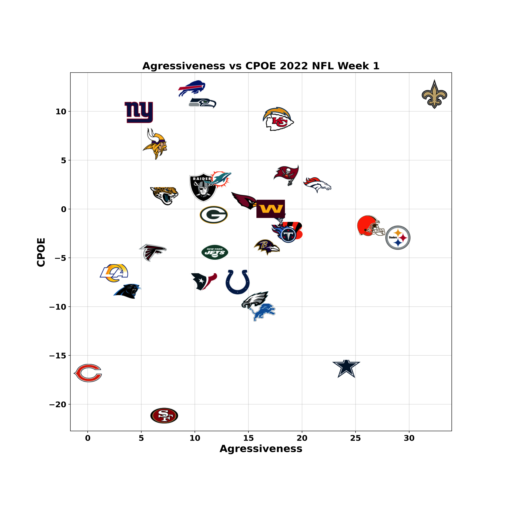
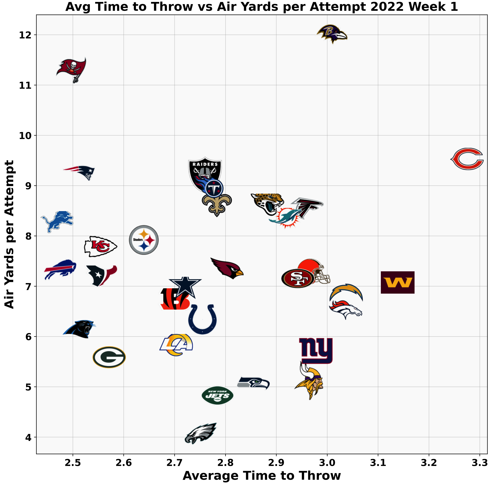

# NFL-Data
# Using data from Next Gen Stats, I created various visualizations to analzye player performance for the 2022 NFL season.

## QB Analysis
# Agressivness vs CPOE
This shows how often a quarterback throws the ball into tight coverage and the percentage of passes they completed above or under expected.

# Average Time to Throw vs Air Yards per Attempt
This shows how long each quarterback had to throw and how far they threw the ball on average.

